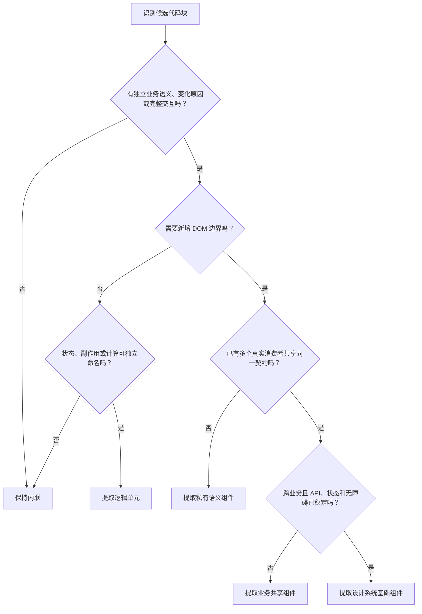

# 组件边界决策框架

本文件用于判断框架无关的 UI 组件边界。先确定变化和所有权，再决定是否创建新文件或共享抽象。

## Contents

- [Core Principles](#core-principles)
- [Decision Flow](#decision-flow)
- [Boundary Signals](#boundary-signals)
- [Action Levels](#action-levels)
- [Public Interface](#public-interface)
- [Interaction And Accessibility](#interaction-and-accessibility)
- [Smells](#smells)
- [Verification](#verification)
- [Evidence](#evidence)

## Core Principles

| 原则 | 判断方式 |
| --- | --- |
| 业务语义 | 组件名称能否表达用户、领域对象或任务，而非视觉外形 |
| 单一变化原因 | 内部内容是否通常因同一个需求一起修改 |
| 高内聚 | 结构、状态和交互是否共同完成一个可理解目标 |
| 低耦合 | 使用方是否只依赖清晰契约，而不知晓内部结构 |
| 状态所有权 | 状态是否位于所有消费者的最近合理共同所有者 |
| 交互完整性 | 语义、焦点、键盘和反馈是否由一个边界完整负责 |
| 最小充分抽象 | 只创建当前需求所需层级，不为假设的未来扩展设计 |

## Decision Flow

决策可以返回“保持原状”。拆分不是默认成功条件。

## Boundary Signals

| 问题 | 强信号 | 弱信号或反信号 |
| --- | --- | --- |
| 它代表什么 | 可命名的用户任务、领域对象、页面区域 | 只能命名为 wrapper、content、common |
| 为什么变化 | 有独立需求、权限、状态或交互变化 | 只因文件较长或缩进较深 |
| 谁拥有状态 | 状态只服务该交互单元 | 状态被提取后仍需大量双向同步 |
| 是否完整交互 | 包含触发、反馈、键盘和错误处理 | 只截取交互的一半或破坏语义 DOM |
| 依赖方向 | 通过少量领域 props、事件或 slots 连接 | 需要传递父组件大部分内部变量 |
| 是否可独立理解 | 输入、输出和失败状态清楚 | 必须来回阅读父组件才能理解 |
| 是否真实复用 | 多个消费者共享语义与行为 | 仅视觉相似、一次重复或未来猜测 |
| 是否有测试缝 | 能按用户行为隔离关键状态 | 只为测试私有函数而创建组件 |

单个强信号可以支持私有提取；进入共享层通常需要多个强信号同时成立。

## Action Levels

| 层级 | 契约 | 位置建议 |
| --- | --- | --- |
| 内联内容 | 无独立契约 | 留在所属组件 |
| 私有子组件 | 只服务当前页面、区域或组件族 | 与拥有者共置，并用父级或业务前缀命名 |
| 逻辑单元 | 输入、输出、生命周期和错误语义清楚 | 与使用它的 feature 共置；真实复用后再上移 |
| 业务共享组件 | 领域对象、动作和无障碍语义稳定 | 放在业务 feature/entity 的公开边界 |
| 基础组件 | 跨领域视觉与交互契约稳定 | 放入已存在的设计系统或 shared UI 层 |

不要因为代码提取成文件就自动提升到 shared。物理拆分与抽象层级是两项独立决策。

## Public Interface

- 用业务输入和领域事件表达接口，例如 `category`、`onCategorySelect`，而不是泄露内部 DOM 操作。
- 优先组合、children 或 slots 表达开放内容；不要用大量布尔 props 组合出互相矛盾的模式。
- 将一起变化且共享不变量的输入组成明确对象；不要为了减少 props 数量传递整个页面状态。
- 只导出真实调用方需要的符号；私有子组件保持私有。
- 共享前列出至少两个真实消费场景，核对它们是否共享语义、状态和无障碍契约，而非只有样式。

## Interaction And Accessibility

- 把一个控件模式的角色、状态、属性、键盘模型、焦点和反馈视为同一职责。
- 拆分后继续使用原生语义元素；不要用组件包装把 `button`、`label`、标题或 landmark 关系拆散。
- 焦点陷阱、roving tabindex、组合控件键盘导航等应保留单一明确所有者。
- 验证 loading、empty、error、disabled、read-only、expanded、selected 和 retry 等真实状态。
- 可访问性责任可以跨文件实现，但必须有一个组件或逻辑单元负责完整契约。

## Smells

| 欠拆信号 | 过拆或错误抽象信号 |
| --- | --- |
| 修改一个区域必须阅读大量无关代码 | 组件只包一层无语义 DOM，且没有复用或独立变化 |
| 数据、业务规则、请求和复杂交互混在同一渲染函数 | 父子间传递大量内部变量、setter 和样式细节 |
| 多个独立状态机共享一组模糊布尔值 | `Common`、`Generic`、`Universal` 名称无法说明职责 |
| 无障碍逻辑散落，没人拥有完整键盘模型 | 用一个巨型配置对象支持不相关业务场景 |
| 同一业务契约在多个消费者中同步演化 | 为满足目录层级或 Atomic Design 标签而创建文件 |

数字只能作为调查提示，不能作为强制拆分门槛。行数、props 数或 Hook 数较大时，回到语义、变化原因和所有权判断。

## Verification

1. 比较重构前后的公开导出和调用方。
2. 验证主要成功路径以及 loading、empty、error、retry 状态。
3. 验证键盘、焦点、可访问名称和语义结构。
4. 运行项目类型检查、测试、构建及必要的浏览器检查。
5. 只在有测量数据时声明性能改善。

## Evidence

- [React: Thinking in React](https://react.dev/learn/thinking-in-react)
- [Angular Style Guide](https://angular.dev/style-guide)
- [Parnas: On the Criteria To Be Used in Decomposing Systems into Modules](https://doi.org/10.1145/361598.361623)
- [Atomic Design Methodology](https://atomicdesign.bradfrost.com/chapter-2/)
- [GOV.UK Design System contribution criteria](https://design-system.service.gov.uk/community/contribution-criteria/)
- [Carbon component checklist](https://carbondesignsystem.com/contributing/component-checklist/)
- [WAI-ARIA Authoring Practices Guide](https://www.w3.org/WAI/ARIA/apg/)
- [Testing Library guiding principles](https://testing-library.com/docs/guiding-principles/)
